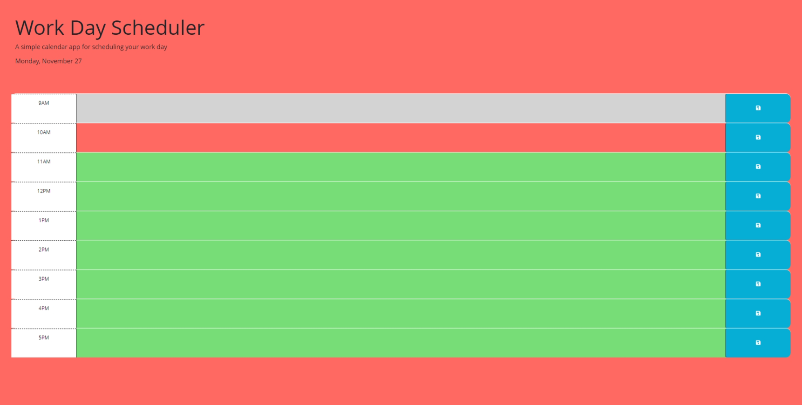

## Work Day Scheduler 
A simple and easy to use scheduling tool for everyone.

## Features
This application features a display of sections for the hours (9am-5pm) the typical us workday. 
These sections let the user know the current plan/plans at the time displayed. 
The current day and month are displayed at the top of the webpage. 

## Application links 

Deployed Application: <Insert Deployed link Here>
Getting Started: Prerequisites Web browsers including Chrome, Firefox, Safari Usage: Clone the repository bash Copy code git clone <INSERT GITHUB LINK HERE>Contributing: Contributions are always welcome! Please read my contributing guidelines to get started.

## Sources and Tools

License This project is licensed under the MIT License - see the LICENSE.md file for details.

Acknowledgments: Thanks to theses resources for information crucial to this project.Udemy,BCS,ChatGPT,BCS. [https://www.udemy.com/ , https://www.youtube.com/ , https://bootcampspot.com , https://chat.openai.com/, https://www.w3schools.com/]

